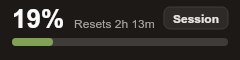
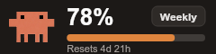
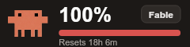

# Claude Code Usage for Flexbar

Display your [Claude Code](https://claude.com/claude-code) usage limits live on your [Flexbar](https://eniacelec.com/products/flexbar) — like a [clawdmeter](https://github.com/HermannBjorgvin/Clawdmeter), but on the macro bar you already own.

Each key shows one usage limit as a meter: the current percentage, a progress bar that shifts from green through orange (75%) to red (100%) as usage increases, the time until the limit resets, and optionally Clawd, the Claude Code crab.





## Features

- **Session meter** — your 5-hour rolling usage window
- **Weekly meter** — your 7-day usage window (all models)
- **Per-model weekly meter** — the model-scoped weekly limit (e.g. Opus)
- Tap a key to refresh immediately
- No API key needed — reads your existing Claude Code login
- Respects a custom key background color set in FlexDesigner
- Optional Clawd mascot, using the official pixel-art artwork

## How it works

The plugin reads the OAuth token that Claude Code stores on your machine (`~/.claude/.credentials.json`, or the Keychain on macOS) and polls the same usage endpoint that Claude Code's own `/usage` command uses. Usage polling costs no tokens and nothing is sent anywhere except to `api.anthropic.com`.

One usage request serves all keys, at most one request every 30 seconds. If the endpoint rate-limits the plugin (HTTP 429), it honors the server's `Retry-After`: keys show a countdown until usage data returns, and no requests are made until then.

When the stored token expires, the plugin refreshes it the same way Claude Code does (via the stored refresh token) and writes the new token pair back to the credential store — so the meters keep working even if you only use the Claude desktop app and never run the CLI. If the refresh token itself has been revoked, keys ask you to log in with Claude Code again.

Requirements:

- [Claude Code](https://claude.com/claude-code) installed and logged in on the same computer
- A Claude subscription (Pro / Max) — API-key-only accounts have no usage limits to display

## Installation

Install from [Flexgate](https://flexgate.enilinx.com/), or download the `.flexplugin` file from the [latest release](https://github.com/Sese-Schneider/flexbar-claude-code-usage/releases) and install it via FlexDesigner.

## Configuration

**Global settings** (plugin config page):

| Setting | Default | Description |
| --- | --- | --- |
| Credentials file | auto-detect | Override path to `.credentials.json` (useful with `CLAUDE_CONFIG_DIR`) |
| Refresh interval | 180 s | How often usage is polled (minimum 60 s) |

**Per key:**

| Setting | Default | Description |
| --- | --- | --- |
| Usage limit | Session | Session (5 h), Weekly (all models), or Weekly (per model) |
| Show time until reset | on | Show the countdown until the limit resets |
| Show Clawd | off | Show Clawd, the Claude Code crab, next to the meter |

The countdown sits next to the percentage; on narrow keys with Clawd enabled it moves below the progress bar. A custom background color set in the key's style editor is used as the meter background.

## Development

```bash
npm install
npm run build          # bundle src/ -> <plugin>/backend/plugin.cjs
npm run dev            # link into FlexDesigner + watch + debug
npm run plugin:pack    # produce dev.sese.flexbar_claude_code_usage.flexplugin
```

FlexDesigner must be running for `npm run dev`.

## License

[MIT](LICENSE)
